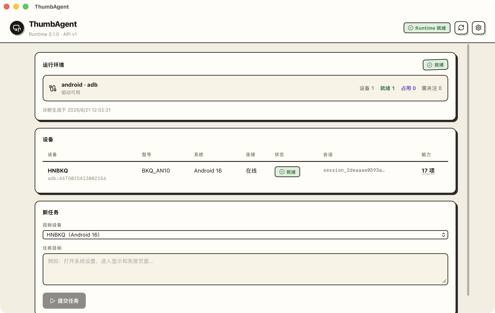

# ThumbAgent

> Local-first platform that gives AI agents a real thumb on mobile devices.

[](https://github.com/LiuShiYi1027/ThumbAgent/actions/workflows/ci.yml)
[](https://github.com/LiuShiYi1027/ThumbAgent/releases/latest)
[](./LICENSE)
[]()

[中文](./README.md) | English

---

Describe a goal in natural language. ThumbAgent's agent runs the full loop on a
real Android device — **observe → plan → act → verify → recover** — and produces
reproducible, auditable execution reports:

```text
Natural-language goal
    → Task planning (LLM Planner)
    → Device actions (Schema / Capability / Policy checked)
    → State observation (screenshot + UI tree)
    → Result verification & failure recovery
    → On-device evidence capture (logs, performance, screenshots)
    → Reproducible, auditable execution report
```

Everything stays local: no cloud accounts, no telemetry, secrets live only in
the system keychain.



## Quick Start

### Option 1: Download the app (recommended)

Grab `ThumbAgent_x.x.x_aarch64.dmg` from
[Releases](https://github.com/LiuShiYi1027/ThumbAgent/releases/latest)
(macOS Apple Silicon, signed & notarized) and drag it into Applications.

On first launch, open **Settings** and configure your model provider
(Base URL / model / API key). The API key is stored only in the macOS
Keychain — never written to disk.

**Prerequisites**: one Android device with USB debugging enabled + ADB
installed on the host.

### Option 2: Run from source

```bash
git clone https://github.com/LiuShiYi1027/ThumbAgent.git
cd ThumbAgent

make check          # Python gate: lint / typecheck / tests / contract checks
make run            # Start the Runtime (default 127.0.0.1:8765)

cd apps/desktop
npm install
npm run tauri dev   # Desktop workbench
```

Requires Python 3.11+, Node 20+, Rust stable, and ADB.

## Core Capabilities

- **Natural-language tasks**: type a goal in the workbench; the agent plans and executes over multiple rounds
- **Real device loop**: device discovery, screen observation, tap/swipe/text actions, completion verification, bounded retry on transient failures
- **Timeline & reports**: per-round screenshots, decisions, actions and results — fully auditable
- **Manual takeover**: pause the agent at a safe boundary, operate the device yourself, then resume; the takeover window is recorded in the event stream
- **Diagnostic evidence**: redacted logs, aggregated performance snapshots, performance comparison, one-call diagnostic bundles (local ZIP with SHA-256 manifest)
- **Data governance**: local artifact retention policies with two-phase authorized cleanup
- **Open interfaces**: local HTTP API + MCP server for external agents such as Codex

## Desktop Workbench

A native Tauri 2 app with a mono editorial design: auto-launches and
authenticates the local Runtime, unified readiness diagnostics, device list
with live screen preview (in a phone frame), task submission with execution
timeline, and first-run settings onboarding.

## Security Design

- Every device action passes **Schema / Capability / Policy** validation and is bound to an explicit `device_id`
- Medium/high-risk actions require **explicit confirmation**; payments, verification codes and permission bypasses are refused outright
- No arbitrary shell, no raw ADB passthrough, no hidden escape hatches; install/uninstall/cleanup use two-phase approval flows
- Model output is always treated as untrusted input: structured parsing + allowlist re-validation
- Secrets and tokens live only in the system keychain and process environment — never in code, databases, or logs

## Architecture

```text
Clients / Interfaces (Desktop · CLI · MCP · Web)
        ↓
Application / Skills / Task Engine
        ↓
Domain / Policy / Contracts
        ↓
Device Gateway
        ↓
Platform Adapters (Android via ADB)
```

All cross-module data is contract-first: schemas are defined in
`contracts/schemas/`, then language types are generated. See
[architecture rules](./docs/architecture/rules.md).

## Documentation

**Product**: [Positioning](./docs/product/positioning.md) · [V1 Solution](./docs/product/solution-v1.md) · [Technical Design](./docs/architecture/technical-design-v1.md)

**Engineering**: [Development](./docs/engineering/development.md) · [Iteration Index](./docs/iterations/README.md) · [Distribution & Release](./docs/engineering/distribution.md) · [Security](./docs/engineering/security.md) · [ADRs](./docs/adr/README.md)

**Contributing**: [Agent Guide](./AGENTS.md) · [Contributing Guide](./CONTRIBUTING.md)

## Roadmap

V1 delivers the local AI-to-device loop for a single Android device (shipped as
v0.1.0). Next: broader device capabilities, evaluation-suite improvements, and
iOS exploration. See the [iteration index](./docs/iterations/README.md).

## License

[Apache-2.0](./LICENSE)
